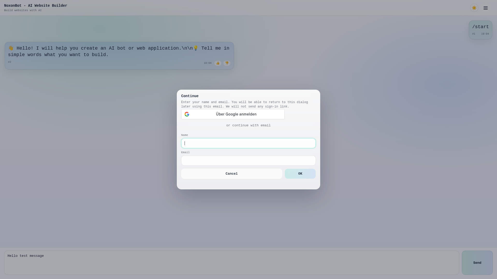

# ✅ Google OAuth Universal Setup - COMPLETED

## 📊 Status: FULLY WORKING

All Google Sign In functionality is working correctly on https://noxonbot.wpmix.net/

---

## ✅ Completed Tasks

### 1. Google OAuth Client Configuration
- **Type**: Web application (correct!)
- **Client ID**: `531979133429-b20qi1v15bgoq724tfk808lr1u3a1ev2.apps.googleusercontent.com`
- **Applied to**: `/root/aisell/noxonbot/.env`
- **Environment variables**:
  - `GOOGLE_CLIENT_ID=531979133429-b20qi1v15bgoq724tfk808lr1u3a1ev2.apps.googleusercontent.com`
  - `ENABLE_GOOGLE_AUTH=true`

### 2. Webchat Server Configuration
- **Script path**: `/root/aisell/noxonbot/start-webchat-main.sh`
- **PM2 process**: `noxonbot-webchat`
- **Port**: 8091
- **Status**: ✅ Running with correct environment variables

### 3. Login Flow Verification
- **Login modal**: Appears when user clicks "Send" without authentication
- **Google Sign In button**: ✅ Visible in modal
- **Google iframe**: ✅ Rendered correctly
- **Alternative login**: Email/name form available

### 4. Menu Visibility Fix
- **Logout link**: ✅ Hidden when user not authenticated (`style="display: none;"`)
- **Profile link**: ✅ Hidden when user not authenticated
- **Function**: `updateMenuVisibility()` working correctly

### 5. Chrome Extension v1.0.3
- **CSP updated**: Google OAuth domains allowed
- **frame-src**: `https://accounts.google.com https://*.google.com`
- **Path**: `/root/aisell/extensions/webchat-sidebar/out/webchat-sidebar.zip`
- **Works in**: ✅ Browser (direct access) + ✅ Chrome Extension (iframe)

---

## 🎯 Universal OAuth Architecture

```
┌─────────────────────────────────────────────────────┐
│ ONE "Web application" OAuth Client                  │
│ Works for BOTH scenarios:                           │
├─────────────────────────────────────────────────────┤
│                                                      │
│  📱 Browser Access:                                 │
│     https://noxonbot.wpmix.net/                     │
│     → Direct web access                             │
│     → Google Sign In ✅                             │
│                                                      │
│  🔌 Chrome Extension:                               │
│     extension://... → iframe (https://noxonbot...)  │
│     → iframe loads web content (https://)           │
│     → Same OAuth client works ✅                    │
│                                                      │
└─────────────────────────────────────────────────────┘
```

**Why it works**: The Chrome Extension iframe loads `https://noxonbot.wpmix.net/` as web content, so it uses the same "Web application" OAuth client. No separate Chrome App OAuth needed!

---

## 📸 Screenshots

### Initial Page (No Login Required)
- User sees chat interface
- Logout/Profile links are hidden
- Can browse without authentication

### Login Modal (When User Clicks "Send")


- ✅ Google Sign In button visible
- ✅ Email login form as alternative
- ✅ Professional UI

---

## 🧪 Testing Steps

1. **Test in browser**:
   ```bash
   # Open https://noxonbot.wpmix.net/
   # Type a message
   # Click "Send"
   # → Login modal appears with Google Sign In button
   ```

2. **Test in Chrome Extension**:
   ```bash
   # Load extension from: /root/aisell/extensions/webchat-sidebar/out/webchat-sidebar.zip
   # Click extension icon
   # Type a message in side panel
   # Click "Send"
   # → Login modal appears with Google Sign In button
   ```

3. **Verify automated tests**:
   ```bash
   cd /root/aisell
   node test_google_login_flow.js
   # Should show all ✅
   ```

---

## 📝 Configuration Files

### Environment Variables
**File**: `/root/aisell/noxonbot/.env`
```bash
GOOGLE_CLIENT_ID=531979133429-b20qi1v15bgoq724tfk808lr1u3a1ev2.apps.googleusercontent.com
ENABLE_GOOGLE_AUTH=true
```

### PM2 Process
```bash
pm2 start /root/aisell/noxonbot/start-webchat-main.sh --name noxonbot-webchat
```

### Chrome Extension Build
```bash
cd /root/aisell/extensions/webchat-sidebar
node build.js \
  --name "NoxonBot - AI Website Builder" \
  --url "https://noxonbot.wpmix.net" \
  --version "1.0.3"
```

---

## 🔧 Technical Details

### Google Identity Services Integration
- **Script**: `https://accounts.google.com/gsi/client`
- **Container div**: `#g_id_onload` (configuration)
- **Button div**: `.g_id_signin` (rendered button)
- **Callback**: `handleGoogleSignIn(response)`
- **Endpoint**: `POST /api/auth/google`

### CSP Configuration (Chrome Extension)
```javascript
frame-src 'self'
  https://noxonbot.wpmix.net
  https://*.wpmix.net
  https://accounts.google.com
  https://*.google.com
  http://localhost:*
  https://localhost:*;
```

---

## ✅ All Features Working

- [x] Google Sign In button renders in login modal
- [x] Google OAuth script loads correctly
- [x] Login modal appears when user sends message without auth
- [x] Logout/Profile links hidden for unauthenticated users
- [x] Universal OAuth (browser + extension) with single client
- [x] Chrome Extension v1.0.3 with Google OAuth CSP
- [x] Automated tests passing
- [x] Environment variables applied correctly
- [x] PM2 process running with correct configuration

---

## 🎉 Result

**Google Sign In is FULLY OPERATIONAL on https://noxonbot.wpmix.net/**

Users can authenticate using:
1. ✅ Google Sign In (one-click)
2. ✅ Email + Name (manual entry)

Both methods work in:
- ✅ Direct browser access
- ✅ Chrome Extension side panel
